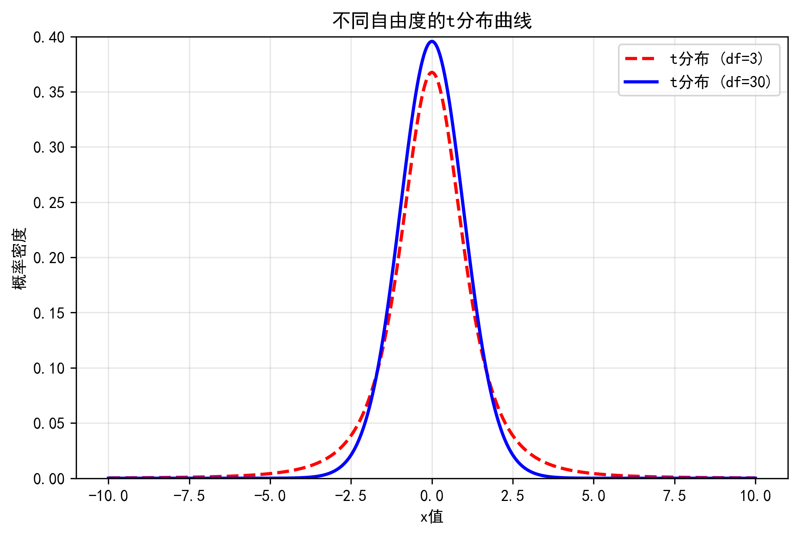
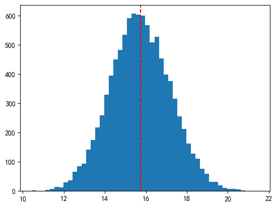
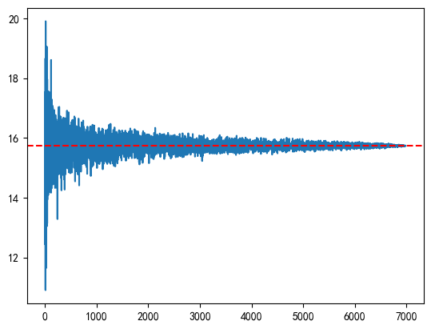

# 关于《生物医学统计基础》的Python基础
很不幸，这门课以及另一门《人工智能基础》都用的是Python。对于笔者而言，最难的并不是配置环境，而是跑通老师发的demo文件。作为此课程的第一篇Blog，打算总结一下需要用到的Python基础。

## 常用软件包
一般都会加载并且给这些软件包取一个简单的别名
```Python
    import pandas as pd
    import numpy as np
    import scipy.stats as stats
    import matplotlib.pyplot as plt
    import seaborn as sns
    # 对于线性回归分析，还可以加载
    import statsmodels .api as sm 
    import statsmodels.formula.api as smf
```

## pandas基本操作
```pd.read_csv()```：将硬盘上的 CSV 文本文件读取到内存中，并转换成一个 ```DataFrame```（数据框）对象。

```pd.DataFrame.info()```：打印数据集的概览信息，包括行数、列数、每列的数据类型以及是否存在缺失值。

```pd.DataFrame.describe()```：自动计算数值列的常用统计指标，如有效样本量（count）、均值（mean）、标准差（std）、最大最小值（max/min）及四分位数。
```pd.DataFrame.groupby()```：根据某一列或多列的取值将数据拆分成不同的组，是进行分组统计（如按性别对比）的前提，括号里是列名。

```pd.DataFrame.agg()```：对数据集（或分组后的数据）一次性调用多个统计函数（如同时计算均值和方差）。

在加载完数据后，比如 ```data=pd.read_csv(mtcars.csv")```
我们就可以对```data```进行一系列操作了：
```data.max / data.min``` 可以查找每一列的最大/最小值并返回。
```data.head(n) / data.tail(n)```查看前面/最后n行并返回，默认返回5行。
```data.info()```打印数据集的概览信息，包括行数、列数、每列的数据类型以及是否存在缺失值。
```data.sum()```每列求和。
```data.describe()```自动计算并汇总数值列的常用统计指标，包括样本量、均值、标准差、最大最小值以及三个关键分位数（25%、50%、75%）。
```data.groupby()```这个函数有很多变式，我们一个一个来介绍：
- ```data.groupby("A")```，根据选定的这一列A，把数据分成两组。
- ```data.groupby["A", "B"]```，根据选定的这一列A，把数据分成两组，然后再按照列B分类。
- ```data.groupby("A")["B"]```, 按列A分组后只看列B的数据。在这之后还可以跟以上的操作，当然还可以自定义使用```agg()```函数,比如```.agg(['max', 'min', 'mean', 'count'])``` 就可以得到最值以及平均数、样本数。

## 分布函数

其实对于很多函数的用法，都可以使用```?```指令，比如输入```?stats.norm```，计算机就会返回一下说明：
```Python

Signature:       stats.norm(*args, **kwds)
Type:            norm_gen
String form:     <scipy.stats._continuous_distns.norm_gen object at 0x0000024156BA2290>
File:            e:\anaconda3\envs\med_env\lib\site-packages\scipy\stats\_continuous_distns.py
Docstring:      
A normal continuous random variable.

The location (``loc``) keyword specifies the mean.
The scale (``scale``) keyword specifies the standard deviation.

As an instance of the `rv_continuous` class, `norm` object inherits from it
a collection of generic methods (see below for the full list),
and completes them with details specific for this particular distribution.

Methods
-------
rvs(loc=0, scale=1, size=1, random_state=None)
    Random variates.
pdf(x, loc=0, scale=1)
    Probability density function.
logpdf(x, loc=0, scale=1)
    Log of the probability density function.
cdf(x, loc=0, scale=1)
    Cumulative distribution function.
logcdf(x, loc=0, scale=1)
...

Returns
-------
rv_frozen : rv_frozen instance
    The frozen distribution.

```

我们以一次为例来讲解一下Python常见的分布函数

### 分布类型
``` Python
stats.norm #正态分布
stats.binom #二项分布
stats.t #t分布
stats.chi2 #卡方分布
stats.f #f分布
```
在正态分布中有一些参数：```loc```代表location，对应分布的均值$\mu$; ```scale```对应分布的标准差$\sigma$。
对于其他连续型分布，如t分布和卡方分布，这两个参数仍然存在，在标准t分布或者卡方分布中，```loc=0```,``` scale=1```。此外他们还多了一个参数——自由度，degrees of freedom，在程序中表示为```df```。
而对于离散型分布，如二项分布，则参数完全不一样，而是使用```n```试验次数和```p```单次试验成功的概率。

### Methods
如本部分二级标题下的那个程序块所示，对于不同的分布，我们还可以调用不同的函数。
对于连续分布有以下共有函数：
- ```pdf(x, loc, scale, df)``` Probability Density Function，概率密度函数，可以计算随机变量在x点处的概率。
- ```cdf(x, loc, scale, df)``` Cumulative Distribution Fuction，累计分布函数，可以计算变量小于等于x的概率。
- ```ppf(q, loc, scale, df)``` Percent Point Function，分位数函数，```cdf ```的逆函数，输入累积概率 q 返回对应的临界值 x。
-```sf(x, loc, scale, df)``` Survival Function，生存函数（也称残留函数），计算变量大于x的概率。
- ```isf(q, loc, scale, df)``` Inverse Survival Function，逆生存函数，```sf ```的逆函数，输入右侧尾部概率 q，返回对应的临界值x。
- ```rvs(loc, scale, df, size)``` Random Variates，随机数生成函数，用于从指定的分布模型中抽取指定数量的随机样本。


对于离散分布，如二项分布，也有以上这些函数，不过参数有所调整:
- ```pmf(k, n, p, loc=0)``` Probability Mass Function，概率质量函数，计算离散随机变量恰好等于 k 次成功的概率。
- ```cdf(k, n, p, loc=0)``` Cumulative Distribution Function，累积分布函数，计算变量小于等于 k 次成功的累积概率。
- ```sf(k, n, p, loc=0)``` Survival Function，生存函数，计算变量大于 k 次成功的概率（1 - cdf），在处理极小概率时比直接减法更精确。
- ```rvs(n, p, loc=0, size)``` Random Variates，随机数生成函数，模拟进行 size 组二项试验，并返回每组试验中成功的次数。

很奇怪，为什么二项分布也有参数```loc```，是因为为了保持所有分布对象的 API 接口统一，开发者给每个分布都硬塞了一个 ```loc``` 参数。在二项分布中，```loc```表示起始位置偏移量。它会将整个分布在横轴（k轴）上进行平移。默认``` loc=0 ```表示成功的次数从0开始计数（0, 1, 2...n）。

## 常用可视化函数
* 分布可视化的整合函数: ```displot (distplot)```，可以调用```histplot/kdeplot``` 等
* 含误差棒的柱状图：```barplot```
* 离散变量频次柱状图：```countplot```
* 连续数值变化直方图：```histplot```
* 回归图:``` lmplot```
* 折线图:```lineplot```
* 散点图:```scatterplot```
* 箱体图:```boxplot```
* 核密度图:```kdeplot```
* 双变量图:```jointplot```
* 热图： ```heatplot```
* 成对/配对关系图： ```pairplot```
这些函数的参数就五花八门了，此处就不过多描述，有不会的建议直接```?sns.xxxplot```

## 来画个图吧
说了这么多，我们最终的目的还是为了visualization，接下来让我们总结一下在Python 中如何使用 numpy 和 matplotlib.pyplot 画图。
我们以绘制不同自由度的t分布曲线为例：

```python
# 步骤1：导入必备库
import numpy as np
import matplotlib.pyplot as plt
import scipy.stats as stats
plt.rcParams["font.family"] = ["SimHei", "Microsoft YaHei"]  # 指定中文字体
plt.rcParams["axes.unicode_minus"] = False  # 解决负号显示为方块的问题

# 步骤2：准备绘图数据
x = np.linspace(start=-10, stop=10, num=1000)  # 生成x轴等间距数据
y1 = stats.t.pdf(x, loc=0, df=3, scale=1)      # df=3的t分布概率密度
y2 = stats.t.pdf(x, loc=0, df=30, scale=1)     # df=30的t分布概率密度

# 步骤3：创建画布（自定义大小）
plt.figure(figsize=(8, 5))

# 步骤4：绘制曲线（自定义样式）
plt.plot(x, y1, color="red", linewidth=2, ls="--", label="t分布 (df=3)")
plt.plot(x, y2, color="blue", linewidth=2, ls="-", label="t分布 (df=30)")

# 步骤5：美化标注
plt.title("不同自由度的t分布曲线")
plt.xlabel("x值")
plt.ylabel("概率密度")
plt.legend()  # 显示图例
plt.grid(alpha=0.3)  # 添加网格
plt.ylim(0, 0.4)     # 限定y轴范围

# 步骤6：保存并显示
plt.savefig("t_distribution.png", dpi=300, bbox_inches="tight")
plt.show()
```
最终结果如下所示：

<div align="center">
  
</div>


## 让我们回到统计本身
《概率统计》这门课已经是一年前学过的课了，有些知识点有点忘记了，这里补充一下。
### 几个分布
**卡方分布**：$X_i \sim N(0, 1), \sum_{i=1}^{n}X_i^2 \sim \chi^2(n)$

**t分布**：$Z \sim N(0, 1), \chi^2 \sim \chi^2(n), Z \perp \chi^2 \implies \frac{Z}{\sqrt{\chi^2/n}} \sim t(n)$

**f分布**：$\chi_1^2 \sim \chi^2(m), \chi_2^2 \sim \chi^2(n), \chi_1^2 \perp \chi_2^2 \implies \frac{\chi_1^2/m}{\chi_2^2/n} \sim F(m, n)$

### CLT中心极限定理
```Python
sample_means=[]
reps,ns=10000,50
for i in np.arange(10000):
    sample_i=np.random.choice(data,ns,replace=True)
    sample_means=np.append(sample_means,np.mean(sample_i))

print("总体均值是: %.2f " % np.mean(data))
print("样本均值分布的均值是: %.2f " % np.mean(sample_means))

plt.hist(sample_means,bins=50)
plt.axvline(x=np.mean(data), color='red', linestyle='--')
plt.show()
```

<div align="center">
  
</div>

### LLN大数定律
```Python

sample_means=[]
for ns in np.arange(15,len(data)):
    sample_i=np.random.choice(data,ns,replace=False)
    sample_means=np.append(sample_means,np.mean(sample_i))

print("总体Data的均值为 : %.2f" % np.mean(data))
plt.plot(sample_means)
plt.axhline(y=np.mean(data), color='red', linestyle='--')
plt.show()

```

<div align="center">
  
</div>

