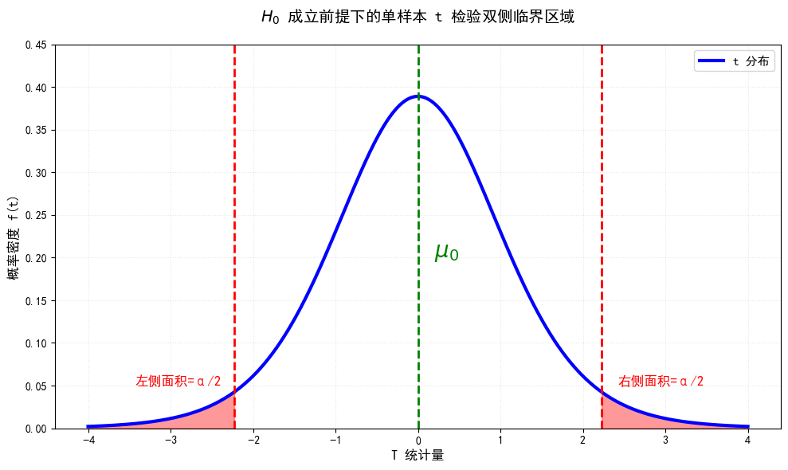

# Unit 3 统计推断方法
统计推断有三大主要方法：
- 置信区间 Confidentce Interval
- 零假设显著性检验 Null Hypothesis Significance Testing
- 贝叶斯统计 Bayesian Statistics

前两种是我们探讨的重点。

## 置信区间 Confidence Interval
### 核心原理
由大数定理（LLN），样本量足够大时，统计量接近于总体参数：
$$(m,s,r) \xrightarrow{n \to \infty } (\mu, \sigma, \rho)$$
而由中心极限定理（CLT）,无论总体是否符合正态分布，当样本量足够大时，样本均值近似服从正态分布。更特别的，若总体符合正态分布 $N(\mu, \sigma^2)$ ，则样本均值 $\bar{x} \sim N(\mu, \frac{\sigma^2}{n})$ 。

这里回顾一下《概率统计》笔记里关于这一部分的步骤：
- **Step 1**：构造枢轴量 $U$ ，且 $U$ 的分布已知且不依赖于任何未知参数。
- **Step 2**：确定置信度 $1-\alpha$。
- **Step 3**：通过代数变形得到 CI。

可以看到，置信区间的一个重要参数是置信度 $1-\alpha$。这里的置信度不是单次观测的概率，而是一种“信心”：对于一组特定的观测数据，求得的置信区间包含总体 $\mu$ 的概率要么是 0 要么是 1。我们之所以说有 $1-\alpha$ 的信心，是因为当采样次数足够多时，长期来看会有 $1-\alpha$ 比例的区间覆盖住真实的 $\mu$。

### 单样本均值的置信区间
对于单个样本的均值，常用的枢轴量有：
- **总体方差 $\sigma^2$ 已知**：$\bar{x} \sim N(\mu, \frac{\sigma^2}{n})$, 标准化后即 $Z = \frac{\bar{x}-\mu}{\sigma/\sqrt{n}} \sim N(0, 1)$。
- **总体方差 $\sigma^2$ 未知**：采用样本方差 $s^2$，则枢轴量为 $T = \frac{\bar{x}-\mu}{s/\sqrt{n}} \sim t(n-1)$。

#### 深入底层：为什么 $t$ 分布的自由度是 $n-1$？
在《生物医学统计基础》中，标准误（$SEM$）的分母涉及样本标准差 $s$。理解 $t$ 分布的自由度，本质上是在理解为什么样本方差 $s^2$ 的分母是 $n-1$。

定义 $t$ 分布为一个标准正态分布变量与一个服从卡方分布变量（除以其自由度再开方）的比值：
$$T = \frac{Z}{\sqrt{V/k}} \sim t(k)$$

统计量 $T$ 可以拆解为：
$$T = \frac{\bar{X}-\mu}{S / \sqrt{n}} = \frac{\frac{\bar{X}-\mu}{\sigma / \sqrt{n}}}{S/\sigma}$$

##### 1. 分子与分母的初步拆解
* **分子**：根据中心极限定理，$\frac{\bar{X}-\mu}{\sigma / \sqrt{n}} \sim N(0, 1)$，是一个标准正态分布变量。
* **分母**：需证明 $\frac{S}{\sigma} \sim \sqrt{\frac{\chi^2(n-1)}{n-1}}$。等价于证明：$\frac{(n-1)S^2}{\sigma^2} \sim \chi^2(n-1)$。

##### 2. 核心代数推导
令 $Z_i = \frac{X_i-\mu}{\sigma} \sim N(0, 1)$。根据样本方差定义 $S^2 = \frac{1}{n-1} \sum (X_i - \bar{X})^2$：
$$\sum_{i=1}^n (X_i-\bar{X})^2 = \sigma^2 \sum_{i=1}^n (Z_i - \bar{Z})^2$$
两边除以 $\sigma^2$：
$$\frac{(n-1)S^2}{\sigma^2} = \sum_{i=1}^n (Z_i - \bar{Z})^2 = \sum_{i=1}^n Z_i^2 - n\bar{Z}^2$$

##### 3. 自由度的“消失”逻辑
1. **总体波动**：$\sum Z_i^2 \sim \chi^2(n)$。
2. **均值波动**：由于 $\sqrt{n}\bar{Z} \sim N(0, 1)$，则 $n\bar{Z}^2 \sim \chi^2(1)$。

根据卡方分布的可加性：
$$\underbrace{\sum_{i=1}^n Z_i^2}_{\chi^2(n)} = \underbrace{\sum_{i=1}^n (Z_i - \bar{Z})^2}_{\text{待求}} + \underbrace{n\bar{Z}^2}_{\chi^2(1)}$$

##### 4. 结论：线性约束的本质
样本均值 $\bar{Z}$ 引入了一个线性约束 $\sum (Z_i - \bar{Z}) = 0$。原本在 $n$ 维空间自由运动的变量被限制在一个 $n-1$ 维的超平面内。因此，$\frac{(n-1)S^2}{\sigma^2} \sim \chi^2(n-1)$，最终得到 $T \sim t(n-1)$。

### 两样本均值差异的置信区间
#### 配对样本 (Paired Samples)
来自同一对象的两次测量（如药前/药后）。通过构造差值 $d_i=x_{1i}-x_{2i}$ 转化为单样本情况，计算 $\bar{d}$ 和 $s_d$，自由度为 $n-1$。

#### 独立样本 (Independent Samples)
##### 1.总体标准差已知

当 $\sigma_1$ 和 $\sigma_2$ 已知时，我们可以知道两个样本均值 $x_1 \sim N(\mu_1, \frac{\sigma_1^2}{n_1})$，$x_2 \sim N(\mu_2, \frac{\sigma_2^2}{n_2})$，所以其样本均值之差:

 $$
 \bar{x_1}-\bar{x_2} \sim N(\mu_1-\mu_2, \frac{\sigma_1^2}{n_1}+\frac{\sigma_2^2}{n_2})
 $$

标准误 $SE=\sqrt{\frac{\sigma_1^2}{n_1}+\frac{\sigma_2^2}{n_2}}$，所以置信区间为：

$$
CI=(\bar{x}_1-\bar{x}_2)\pm Z_{\alpha/2} \cdot \sqrt{\frac{\sigma_1^2}{n_1}+\frac{\sigma_2^2}{n_2}}
$$

##### 2.总体标准差未知但相等

当 $\sigma_1=\sigma_2=\sigma$但未知时，我们采用合并方差法：$s_p^2=\frac{(n_1-1)s_1^2+(n_2-1)s_2^2}{n_1+n_2-2}$，此时我们构造T统计量：

$$
T = \frac{(\bar{X}_1 - \bar{X}_2) - (\mu_1 - \mu_2)}{s_p \cdot \sqrt{\frac{1}{n_1} + \frac{1}{n_2}}} \sim t(n_1+n_2-2)
$$

标准误 $SE=s_p \cdot \sqrt{\frac{1}{n_1} + \frac{1}{n_2}}$，所以置信区间为：

$$
CI=(\bar{x}_1-\bar{x}_2)\pm t_{\alpha/2,n_1+n_2-2} \cdot s_p \sqrt{\frac{1}{n_1}+\frac{1}{n_2}}
$$

##### 3.总体标准差未知且不等

这是最普通的情况，当 $\sigma_1 \neq \sigma_2$ 时，我们不再合并方差，而是直接使用各自的样本方差。此时我们构造T统计量：

$$
T = \frac{(\bar{X}_1 - \bar{X}_2) - (\mu_1 - \mu_2)}{\sqrt{\frac{s_1^2}{n_1} + \frac{s_2^2}{n_2}}} \sim t(df)
$$

标准误 $SE=\sqrt{\frac{s_1^2}{n_1} + \frac{s_2^2}{n_2}}$，而此时的自由度 $df \neq n_1+n_2-2$，而需要用Welch-Satterthwaite 自由度公式来计算：

$$
df=\frac{\left( \frac{s_1^2}{n_1}+\frac{s_2^2}{n_2} \right) ^2}{\frac{1}{n_1-1}\left(\frac{s_1^2}{n_1}\right)^2
+\frac{1}{n_2-1}\left(\frac{s_2^2}{n_2}\right)^2}
$$

最终求得置信区间为：

$$
CI=(\bar{x}_1-\bar{x}_2)\pm t_{\alpha/2,df} \cdot \sqrt{\frac{s_1^2}{n_1}+\frac{s_2^2}{n_2}}
$$

## 零假设显著性检验 Null Hypothesis Significance Testing

### 核心步骤与逻辑框架

#### Step 1: 选择样本统计量与检验类型
* **单样本均值 ($\bar{x}$)**：对比样本与理论基准。
* **两独立样本均值差 ($\bar{x}_1 - \bar{x}_2$)**。
* **配对差均值 ($\bar{d}$)**：对比同一组对象前后的变化。

#### Step 2: 提出假设
* **零假设 ($H_0$)**：无效应假设，如 $H_0: \mu = \mu_0$。
* **备选假设 ($H_1$)**：有效应假设，如 $H_1: \mu \neq \mu_0$。

#### Step 3: 构造统计量
根据条件选择 $Z$ 统计量或 $T$ 统计量。

#### Step 4: 计算 $p$ 值
在 $H_0$ 成立前提下，观测到当前结果（或更极端结果）的概率。

#### Step 5: 设定显著性水平 ($\alpha$)
通常为 0.05，代表承担第一类错误（假阳性）的风险。

***P.S.*** 我们称第一类错误为假阳性，第二类错误为假阴性，什么时候会出现这些错误如下表所示：
| 决策 \ 真实情况 | $H_0$ 为真 (无效应/健康) | $H_0$ 为假 (有效应/患病) |
| :--- | :---: | :---: |
| **拒绝 $H_0$**   (判定显著/阳性) | **第一类错误 ($\alpha$)**   假阳性 (误诊) | **正确决策 ($1-\beta$)**   统计效能 (Power) |
| **接受/不拒绝 $H_0$**   (判定不显著/阴性) | **正确决策 ($1-\alpha$)**   置信水平 (Confidence) | **第二类错误 ($\beta$)**   假阴性 (漏诊) |

#### Step 6: 做出统计决策
* 若 $p \le \alpha$：拒绝 $H_0$，差异具有显著性。
* 若 $p > \alpha$：不拒绝 $H_0$，证据不足。

### 举个例子
假设总体服从正态分布，现在从中随机取样，$n$ 个观测值的均值为 $\bar{x}_0$，方差为 $s^2_0$ 。求在显著性水平为 $\alpha$ 的情况下是否可以认为总体的均值为 $\mu_0$ 。

1. **假设**：$H_0: \mu=\mu_0$，$H_1: \mu \neq \mu_0$
2. **统计量**：$T = \frac{\bar{x} - \mu_0}{s_0/\sqrt{n}} \overset{H_0}{\sim} t(n-1)$
3. **计算**：$T_{obs} = \frac{\bar{x}_0 - \mu_0}{s_0/\sqrt{n}}$，$p=P(|T| \ge|T_{obs}|)=2P(T \ge|T_{obs}|)$
4. **比较**：若 $p \le \alpha$，拒绝 $H_0$ ;若 $p > \alpha$, 不拒绝 $H_0$

正如插图所示，$\alpha$ 是我们提前划定的“警戒线”（拒绝域面积），而 $p$ 值是我们观测到的实际尾部概率面积。

  

- **若 $p \le \alpha$**：观测值掉进了红色拒绝域，说明在该概率水平下结果极其罕见，因此我们 **拒绝 $H_0$**。
- **若 $p > \alpha$**：观测值尚未进入警戒线，虽然有偏差，但仍在合理的随机波动范围内，因此 **不拒绝 $H_0$**。

