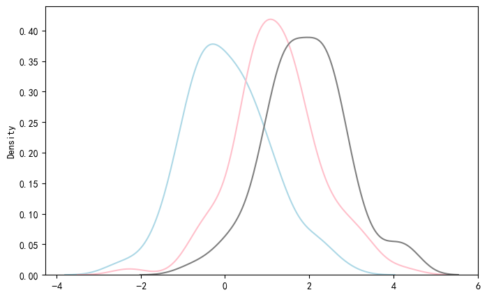
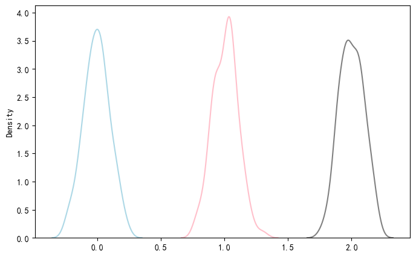
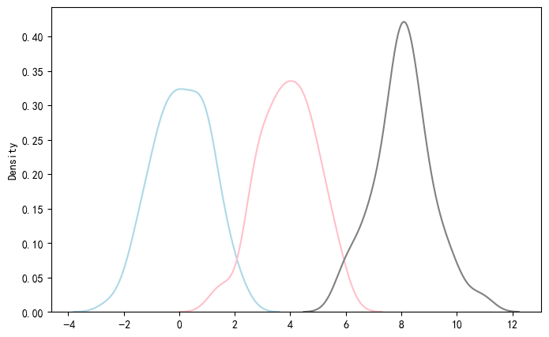

# 方差分析 ANOVA
基于零假设检验，我们引入 **Analysis of Variance (ANOVA)**  。

不妨想象这样的一个现实问题：某个**单次检验**的假阳性率为 $\alpha$ ，对 50 个样本进行检验，则 $n$ 次独立检验后，出现假阳性的概率为 $FPR = 1 - (1 - \alpha)^n$  。以我们在 NHST 中常用的显著性水平 $\alpha = 0.05$ 为例，若检测 100 次，假阳性率将达到 99.4%，非常惊人！  

所以，如果我们在对多个样本进行两两配对 NHST 时，出现第一类错误的概率是累积的  。为了避免以上这种情况，在检验多组均值是否存在差异时，我们先做整体检验，也就是 ANOVA  。

## ANOVA 的原理
### 1. Lead-in
首先我们来看下面三个样本：三个样本的总体都符合正态分布，方差 $\sigma^2$ 均为 1，不过均值 $\mu$ 分别为 0、1、2，每个样本都是从总体随机采样 100 个数据得到的  ：
<div align="center">
  
</div>

可以看到，这三组数据之间并不好区分  。如果我们把三个总体的方差设置小一点呢，比如让 $\sigma^2 = 0.1$，那么得到的分布图如下  ：
<div align="center">
  
</div>

可以看到，三组数据之间已经可以区分得很清楚了  。有没有其他的方法呢？我们让三个总体均值 $\mu$ 的区别变大一点，分别为 0、4、8，那么得到以下的分布图  ：
<div align="center">
  
</div>
可以看到也比最开始的情况好区分  。

### 2. ANOVA 的数学模型
从上面的例子中可以看到，不同数据之间和组内的差异都对我们区分不同总体有影响  。组间差距越大、组内差距越小，我们越能区分不同的总体  。

**抽象为数学模型**：假设一共有 $k$ 组数据，分别属于不同的总体，每组数据都有 $n_i, i = 1, 2, \dots, k$ 个观测值，则总共有 $\sum_{i=1}^{k} n_i = N$ 个观测值  。我们设第 $i$ 组的第 $j$ 个观测值为 $x_{ij}$  。

- **总平方和**：$SST = \sum_{i=1}^{k} \sum_{j=1}^{n_i} (x_{ij} - \bar{x}_{\cdot\cdot})^2$  
- **组间平方和**：$SSB = \sum_{i=1}^{k} n_i (\bar{x}_{i\cdot} - \bar{x}_{\cdot\cdot})^2$  
- **组内平方和**：$SSW(SSE) = \sum_{i=1}^{k} \sum_{j=1}^{n_i} (x_{ij} - \bar{x}_{i\cdot})^2$  
- **关系式**：根据数学公式推导，可知 $SST = SSB + SSW(SSE)$  
- **组间均方**：$MSB = \frac{SSB}{df_B} = \frac{SSB}{k-1}$  
- **组内均方**：$MSW = \frac{SSW}{df_W} = \frac{SSW}{N-k}$  

关于自由度消失的问题，组间方差只有一个总平均值的约束，所以自由度减 1 ($k-1$)；而组内方差有 $k$ 个组内平均值的约束，所以自由度减 $k$ ($N-k$)  。

我们定义 **F 统计量**：
$$ F = \frac{MSB}{MSW} \sim F(df_B, df_W) $$  

**效应量** $\eta^2 = \frac{SSB}{SST}$，表示 $SST$ 中有多少比例是可由 $SSB$ 解释的  。可以看到，样本之间的差异越大，F 统计量的值也越大  。

### 3. ANOVA 的类型
如果实验中同时考察了 $n$ 个因素，我们称为 **n-way ANOVA**（n 因素方差分析），因素一般可以分为组间因素和组内因素两种  。
同时，如果我们对同一组对象进行不同的试验，涉及重复测量，则称 **RM n-way ANOVA**  。比如对一组病人，我们分析他们用了不同药物前后的变化，就涉及重复测量  。
我们主要讨论 **1-way ANOVA** 和 **2-way ANOVA** 两种情况  。

   

## 1-way ANOVA
### 1. Python 函数
首先，1-way ANOVA 的零假设为 $H_0: \mu_1 = \mu_2 = \mu_3$，备选假设为 $H_1: H_0$ 不成立，也就是三个均值至少有两个不相等  。

我们的 anova 函数包含在 `pingouin` 包里：
```python
import pingouin as pg
```
这里简述一下 Python 函数的用法，假如我们要对 `data` 数据进行 1-way ANOVA：
```python
pg.anova(
    data=data, 
    dv='x', 
    between="Group", 
    ss_type=2, 
    detailed=True, 
    effsize='np2'
)

```

- **dv**: 因变量列名  
- **between**: 分组变量列名  
- **ss_type**: 平方和计算类型，一般默认 2  
- **detailed**: bool 类型变量，默认为 True，输出详细表格  
- **effsize**: 效应量，默认为 `np2` ($\text{偏}\eta^2$)  
**输出参数说明**：
- **Source**: 变异来源，本例中为 Group 和 Within  
- **SS**: 平方和
- **DF**: 自由度
- **MS**: 均方  
- **F**: F 统计量；**p_unc**: 未校正 p 值  
- **np2**: $\text{偏}\eta^2$，参考 Cohen (1988) 基准：
  | 效应大小 | $\eta_p^2$ 区间 |
  | :    | :    |
  | 弱效应 | $\eta_p^2 < 0.01$ |
  | 小效应 | $0.01 \le \eta_p^2 < 0.06$ |
  | 中等效应 | $0.06 \le \eta_p^2 < 0.14$ |
  | 大效应 | $\eta_p^2 \ge 0.14$ |  

若 $p < \alpha$，拒绝 $H_0$，进行事后检验两两之间差异的显著性  。

### 2. Post-Hoc 多重检验
最常用的是 `pairwise_tukey()`，在方差齐性时使用  ：
```python
data.pairwise_tukey(
    dv='x',  
    between='Group',  
    alpha=0.05,      
    tail='two-sided'  
)
```  
- **se**: 标准误，$SE = \sqrt{\frac{2 \cdot MSW}{n}}$  
- **T**: 两两比较的 t 值，$T = \frac{diff}{SE}$  
- **p-tukey**: Tukey 矫正后的 p 值  
- **hedges**: Hedges' g 效应量  
   

## RM one-way ANOVA
### 1. 数学原理
对于重复测量单因素方差分析：$SST = SSB + SSS + SSE_{rm}$  。
假设有 $n$ 个受试者，重复测量 $k$ 次，总观测数为 $N = kn$  ：
- **SST**: 总平方和，$df_t = N-1$  。
- **SSB**: 组间平方和（不同条件），$df_b = k-1$  。
- **SSS**: 被试间平方和（个体差异），$df_s = n-1$  。
- **$SSE_{rm}$**: 误差平方和，$df_e = (n-1)(k-1)$  。

**F 检验**：
- **组内效应**：$F(df_b, df_e) = \frac{SSB/df_b}{SSE_{rm}/df_e}$  
- **个体效应**：$F(df_s, df_e) = \frac{SSS/df_s}{SSE_{rm}/df_e}$  

### 2. Python 函数
```python
pg.rm_anova(
    data=data, 
    dv='MoodGain', 
    within='Time', 
    subject='ID',
    detailed=True, 
    effsize='np2',
    correction='auto'
)
```
- **within**: 重复测量的因素/时间点  。
- **subject**: 被试者编号  。
- **correction**: 球形性矫正，默认 `auto`  。

### 3. Post-Hoc 事后检验
```python
pg.pairwise_tests(
    data=df_long,
    dv='Score',
    within='Training', 
    subject='Subject',
    parametric=True,
    padjust='bonf'
)
```
- **parametric**: True 代表使用配对 t 检验  。
- **padjust**: 多重比较校正方法（如 `bonf`, `holm`, `fdr_bh`）  。

   

## 方差分析的具体步骤
### 1. ANOVA 的适用条件
1. **数据类型与独立性**：连续数值，组内观测独立  。
2. **正态性**：`pg.normality()`  。
3. **方差齐性**：`pg.homoscedasticity(method="levene")`  。
4. **球形性 (RM ANOVA)**：`pg.sphericity()`  。

**方法推荐表**：
| 情况 | 推荐方法 | Python 函数 |
| :    | :    | :    |
| 正态、方差齐性 | 经典 ANOVA | `pg.anova()` |
| 方差不齐 | Welch ANOVA | `pg.welch_anova()` |
| 非正态、独立样本 | Kruskal-Wallis | `pg.kruskal()` |
| 非正态、重复测量 | Friedman 检验 | `pg.friedman()` |  

### 2.结果汇报
可以参考以下APA格式进行汇报：
- 描述性统计结果
- 方差分析 F 检验结果：自由度、F统计量的值、p值、效应量等等
- 事后检验结果
- 解释统计结果的生物医学意义

   

## 2-way ANOVA
### 数学模型
对于无重复测量、平衡设计的 2-way ANOVA，设因素 A (a 水平)、B (b 水平)，每水平 $n$ 次观测，$N = a \times b \times n$  ：
$$ SST = SSA + SSB + SSAB + SSE $$  

- **SSA/SSB**: 因素 A/B 的主效应平方和  。
- **SSAB**: 交互作用平方和  。
- **SSE**: 误差平方和，$df_e = ab(n-1)$  。

**F 检验**：
- **因素 A**: $F_a = \frac{SSA/df_a}{SSE/df_e}$  
- **交互作用**: $F_{ab} = \frac{SSAB/df_{ab}}{SSE/df_e}$  

**效应量**：
$$\eta^2_p = \frac{SSA}{SSA + SSE}$$  

### 其他
2-way ANOVA 与 1-way ANOVA 逻辑一致，增加了**交互作用 (Interaction Effect)** 的考虑  。
对于 2-way rm ANOVA，分析思路同样沿用 1-way rm ANOVA  。


